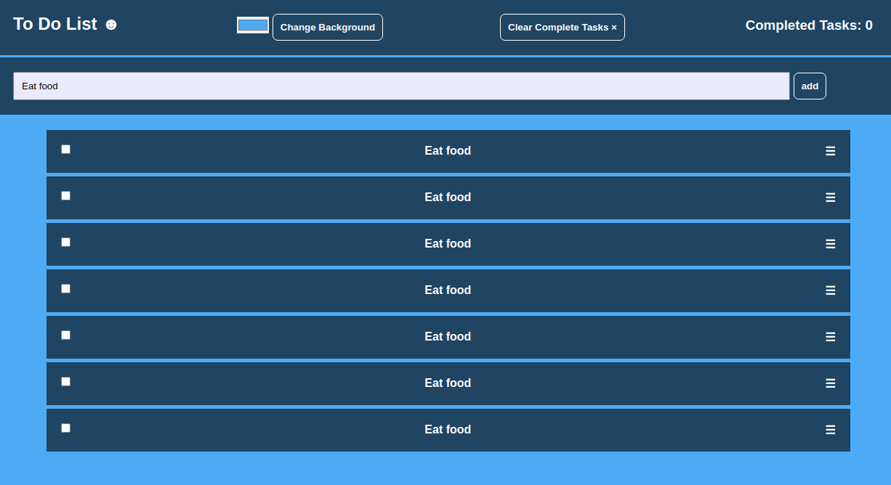
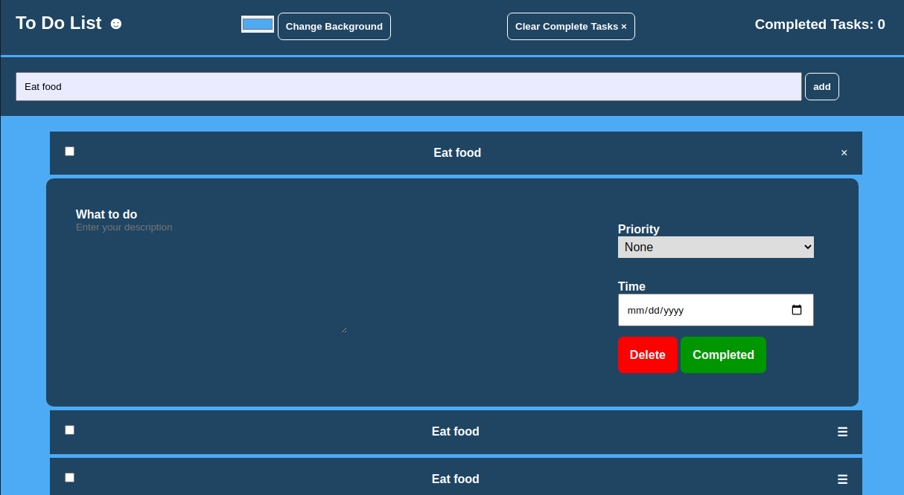
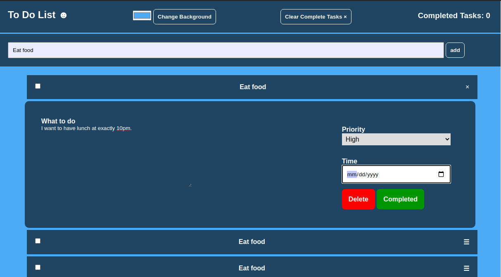
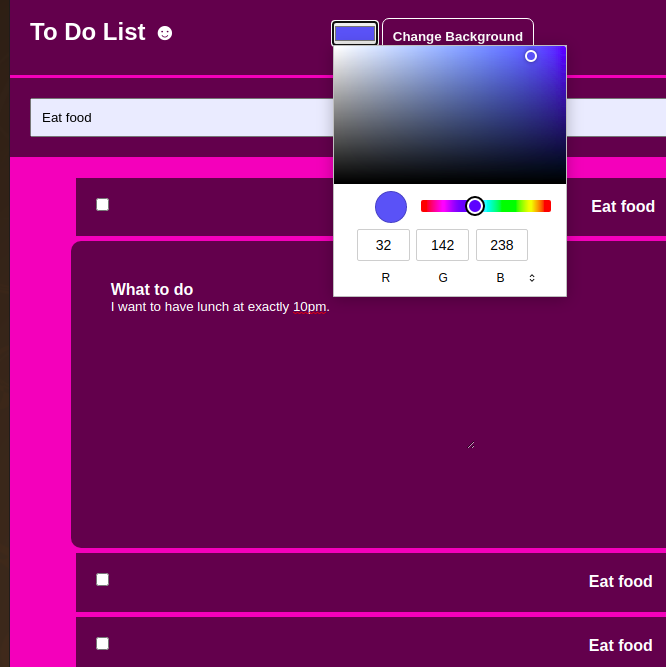

# Advanced ToDo
This is a ToDo app similar to that of Ubuntu.

## How it works
- Users can add Tasks

- Users can edit info specific to the tasks to accomplish

- Users can classify tasks according to priority

- Users can delete and also mark tasks as complete

- Users can customize it to their look and feel.

## Built with 
- HTML , CSS and JavaScript

## Live Project
[The project can be viewed here](https://jod35.github.io/Adv-Todo/.)

## Author 
Ssali Jonathan